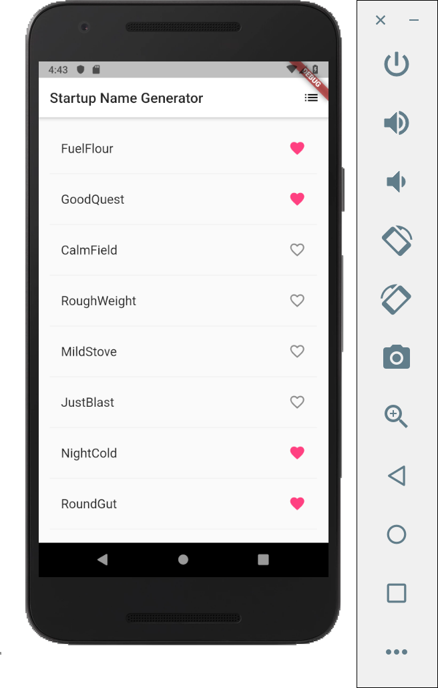
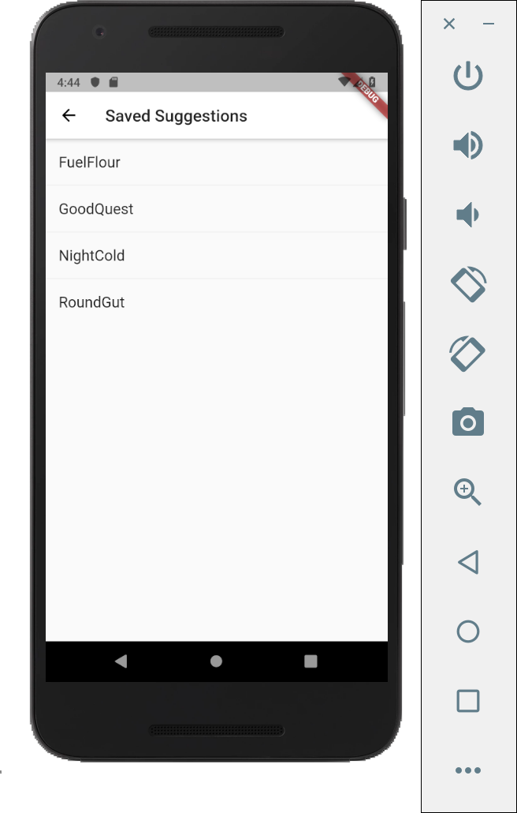

# Startup Name Generator App in Flutter

In this test drive app, we will have a list that will be populated by random generated words, which can be saved and shown in another list of just saved names.

## Library
In the app, we will use an external open-source library that will generate the random English words.

In pubspec.yaml, we just add ```english_words: ^3.1.0``` in the ```dependencies``` as follows:
```
dependencies:
  flutter:
    sdk: flutter

  # The following adds the Cupertino Icons font to your application.
  # Use with the CupertinoIcons class for iOS style icons.
  cupertino_icons: ^0.1.2
  english_words: ^3.1.0 //generate random english words
```
After updating the dependency, run ```pub get``` in the terminal to update our pubspec.yaml.

Then we just simply import the library:
```
import 'package:english_words/english_words.dart';
```

## The main() Function
In Flutter, the main() function usually use arrow notation for one-line functions or methods, in this case, a runApp() method which will run our app.
```
void main() => runApp(MyApp());
```

## MyApp() Class
The MyApp class extends ```StatelessWidget``` which is a widget that describes part of the user interface by building a constellation of other widgets that describe the user interface more concretely. Inside the class we have one ```build()``` method.

```
class MyApp extends StatelessWidget {
  @override
  Widget build(BuildContext context) {

    return MaterialApp(
        title: 'Startup Name Generator',
        theme: ThemeData(
          primaryColor: Colors.white,
        ),
        home: RandomWords(),
    );
  }
}
```

On the line ```home: RandomWords()``` we are stating our home page to the widget named ```RandomWords```.

## RandomWords Class
```RandomWords``` is a widget that calls RandomWordsState() class.
```
class RandomWords extends StatefulWidget {
  @override
  RandomWordsState createState() => RandomWordsState();
}
```

## RandomWordsState Class
```RandomWordsState``` is another widget that handles the list and the methods to generate words and populate them in the list. There are three 

```
class RandomWordsState extends State<RandomWords> {
  final _suggestions = <WordPair>[];
  final Set<WordPair> _saved = Set<WordPair>();
  final _biggerFont = const TextStyle(fontSize: 18.0);

  ...

}
```

### Override the build() method in RandomWordsState

```
@override
  Widget build(BuildContext context) {

    return Scaffold(
      appBar: AppBar(
        title: Text('Startup Name Generator'),
        actions: <Widget>[
          IconButton(icon: Icon(Icons.list), onPressed: _pushSaved),
        ],
      ),

      body: _buildSuggestions(),
    );
  }
```

### Making the list

```
Widget _buildSuggestions() {
    return ListView.builder(
        padding: const EdgeInsets.all(16.0),
        itemBuilder: /*1*/ (context, i) {
          if (i.isOdd) return Divider(); /*2*/

          final index = i ~/ 2; /*3*/
          if (index >= _suggestions.length) {
            _suggestions.addAll(generateWordPairs().take(10)); /*4*/
          }
          return _buildRow(_suggestions[index]);
        });
  }
```


### Making the row

```
Widget _buildRow(WordPair pair) {
    final bool alreadySaved = _saved.contains(pair); 

    return ListTile(
      title: Text(
        pair.asPascalCase,
        style: _biggerFont,
      ),

      trailing: Icon(
        alreadySaved ? Icons.favorite : Icons.favorite_border,
        color: alreadySaved ? Colors.pinkAccent : null,
      ),

      onTap: () {
        setState(() {
          if (alreadySaved) {
            _saved.remove(pair);
          }
          else {
            _saved.add(pair);
          }
        });
      },

    );
  }
```

### Saving the names to another list in another view using Navigator

```
void _pushSaved() {
    Navigator.of(context).push(
      MaterialPageRoute<void>(
        builder: (BuildContext context) {
          final Iterable<ListTile> tiles = _saved.map(
                (WordPair pair) {
              return ListTile(
                title: Text(
                  pair.asPascalCase,
                  style: _biggerFont,
                ),
              );
            },
          );
          final List<Widget> divided = ListTile
              .divideTiles(
            context: context,
            tiles: tiles,
          )
              .toList();

          return Scaffold(
            appBar: AppBar(
              title: Text('Saved Suggestions'),
            ),
            body: ListView(children: divided),
          );
        },
      ),
    );
  }
```

## Result




