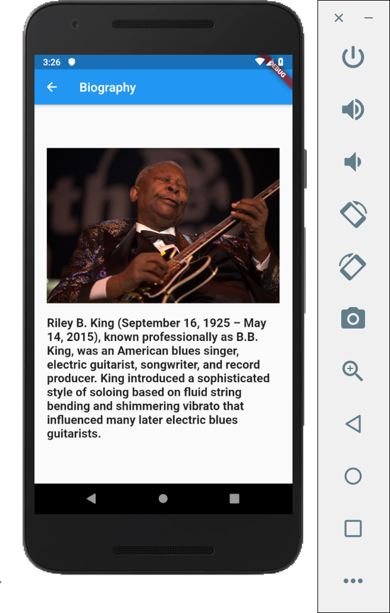
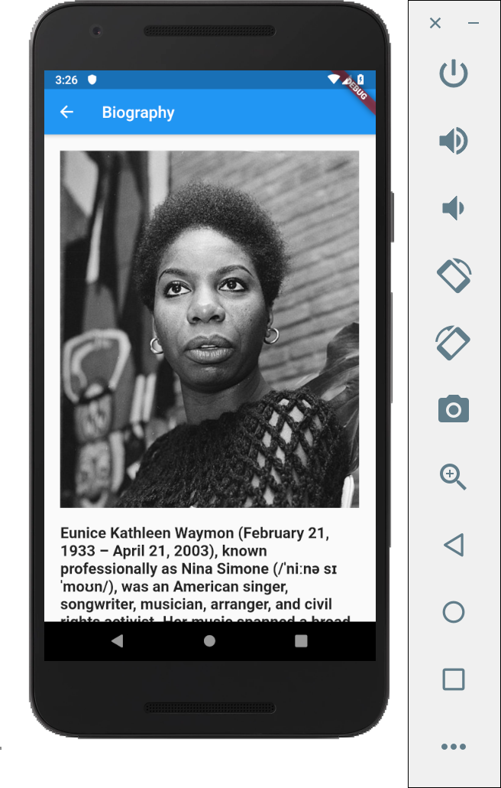

# Screen Navigation based on Tapped Item in a  Static ListView

In this project we are making a simple application having two screens. The first screen contains a static List populated by strings of musician names. The app can navigate to the second screen after a press on an an item in the ListView, then the second screen will show the biography of the musician accordingly.

## Making an ```assets``` Directory
First, we make a new directory in the root directory called ```assets``` that has two child directories, ```\assets\bio``` that contains .txt text files, and ```\assets\images``` that contains .jpg image files that we are going to display in the second page.

Go to pubspec.yaml and add the assets accordingly as follows:

```
flutter:
	assets:
    	- assets/
    	- assets/bio/
    	- assets/images/
```

and then run ```flutter pub get``` in the console.

## main() function

```
void main() => runApp(MyApp());
```

## Root Class

```
class MyApp extends StatelessWidget {
  @override
  Widget build(BuildContext context) {
    return MaterialApp(
        title: 'My App',
        theme: ThemeData(
          primarySwatch: Colors.blue,
        ),
        home: MyHomePage(),
    );
  }
}
```

## MyHomePage Class

```
List<String> names = ['BB King', 'Bob Dylan', 'Dr. John', 'James Booker', 'Nina Simone'];
  List<String> keynames = ['king', 'dylan', 'john', 'booker', 'simone'];

  @override
  Widget build(BuildContext context) {
    return Scaffold(
      appBar: AppBar(
        title: Text('Home Page'),
      ),
      body: Center (
        child: ListView(
          children: _generate(this.names, context)
        ),
      ),
    );
  }

  ...

```

### ```_generate()``` Method

```_generate()``` method returns a list that is made using the ```List.generate()``` from the ```dart:core``` library. Here, we are passing our pre-declared list ```names```.

```
List<Widget> _generate(List names, BuildContext context) {
    return List.generate(names.length, (index) => _generateItem(names[index], context, index));
  }
```

### ```_generateItem()``` Method

For every ```names``` element being passed to ```_generateItem()```, we are making a row of the ListView
```
Widget _generateItem(String name, BuildContext context, int index) {
    return new Container(
      padding: const EdgeInsets.all(8.0),
      child: new Row(
        children: <Widget>[
          new Expanded(
              child: GestureDetector(
                child: new Text(
                    '$name', //element from the list 'names'
                    textScaleFactor: 1.5,
                ),
                onTap: (){goToSecondPage(context, index);}, //passing the index to get the element from the list 'keynames'
              )
          ),
        ],
      ),

    );
  }
```

### ```goToSecondPage()``` Method

This method will navigate to the second page while sending the string value of ```keynames[index]```

```
goToSecondPage(BuildContext context, index){
    return Navigator.push(
      context,
      MaterialPageRoute(
        builder: (context) => SecondPage(name: keynames[index]),
      ),
    )
    ;
 }
```

## SecondPage class

In the ```SecondPage``` class, we have a constructor that requires a string value of ```keynames[index]``` from the home page.

```
class SecondPage extends StatelessWidget {
  final String name;

  SecondPage({Key key, @required this.name}) : super(key: key);


  @override
  Widget build(BuildContext context) {
    return Scaffold(
      appBar: AppBar(
        title: Text('Biography'),
      ),
      body: Center(
          child: SingleChildScrollView( // required to show all of the content in the page
            padding: EdgeInsets.all(10.0),
            child: Column(
                children: <Widget>[
                  Container (
                      padding: EdgeInsets.all(10.0),
                      child: Image(
                        image: loadImageAsset('$name.jpg'),
                      )
                  ),

                  Container(
                    padding: EdgeInsets.all(10.0),
                    child: FutureBuilder(
                      future: loadTextAsset('$name.txt'),
                      builder: (BuildContext context, AsyncSnapshot<String> text) {
                        return new Text(
                          text.data,
                          style: new TextStyle(
                            fontWeight: FontWeight.bold,
                            fontSize: 19.0,
                          ),
                        );
                      },
                    ),
                  ),

                ]
            ),
          )
      ),
    );
  }

  Future<String> loadTextAsset(filename) async {
    return await rootBundle.loadString('assets/bio/$filename');
  }

  loadImageAsset(filename) {
    return AssetImage('assets/images/$filename');
  }

}
```

Inside the class, there are two methods, ```loadTextAsset()``` and ```loadImageAsset()```.

```loadTextAsset()``` uses ```Future``` from the ```dart:async``` library to run an asyncronous operation and ```rootBundle``` from the ```dart:flutter/services.dart``` library to load a string from our .txt file.

```loadImageAsset()``` makes use of the AssetImage() flutter method to get our image.

The imported libraries:
```
import 'package:flutter/material.dart';
import 'dart:async' show Future;
import 'package:flutter/services.dart' show rootBundle;
```

Both the image and text are within ```SingleChildScrollView``` to enable scrolling for lengthy contents.

## Results:




