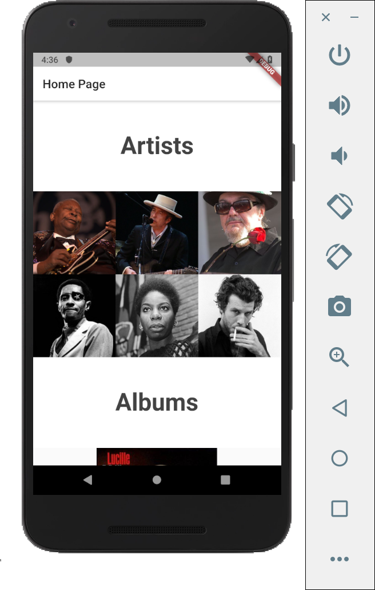
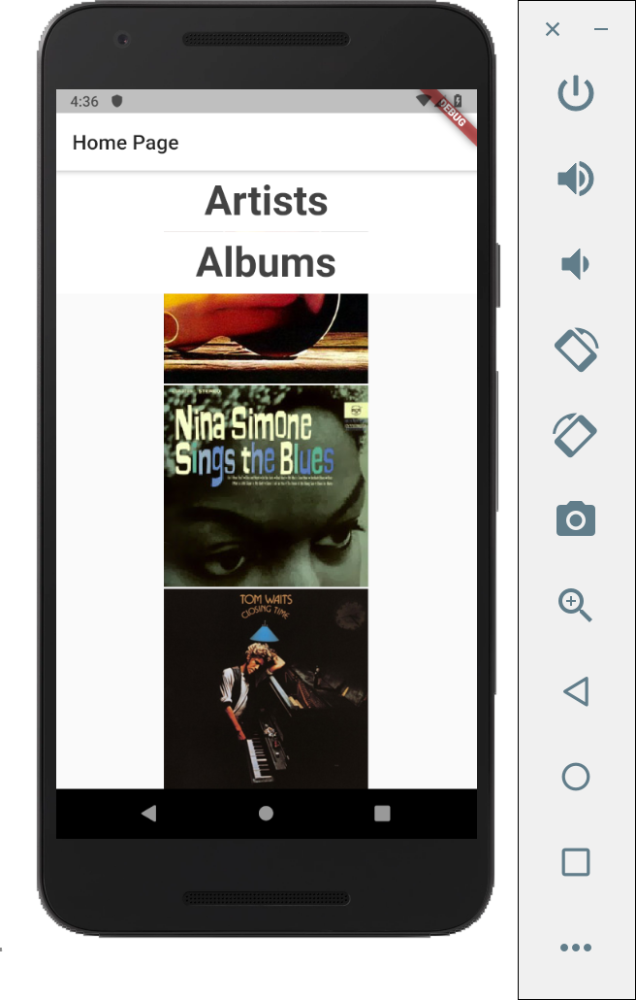
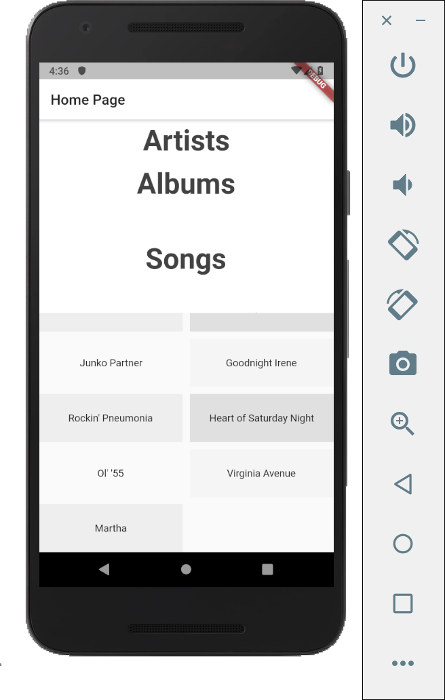
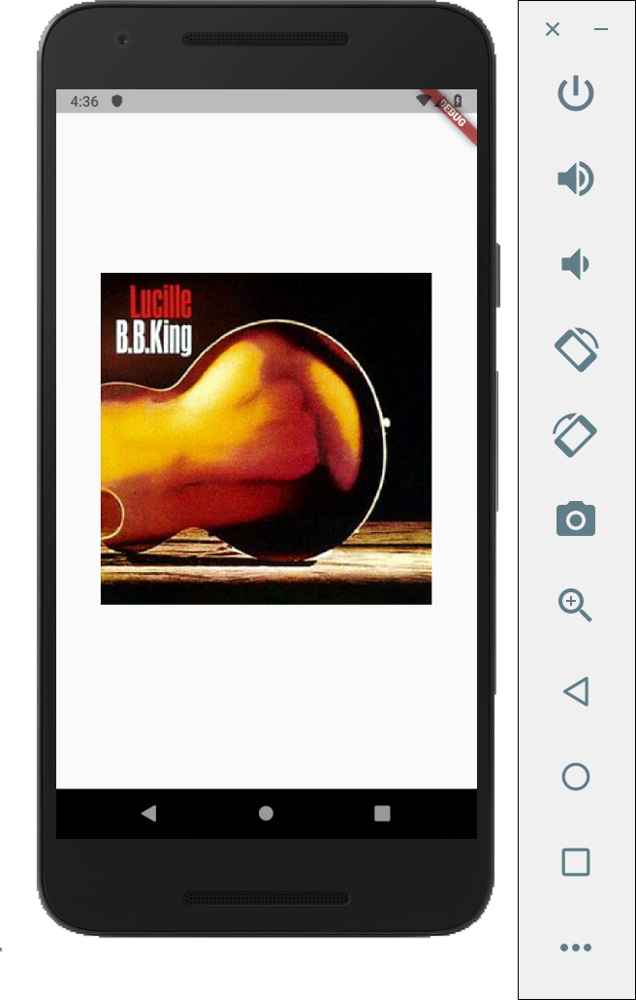

# sliver_app

A Flutter application implementing slivers and gestures.

Here, we are recycling the application that has been made in the previous project (/novice/02-04/) and adding new features such as ```slivers```, and navigating to another page on an item touch using ```gestures```.

The application is showing images of artists in one scrollable area, and images of album and list of songs in the following.

## ```CollapsingList``` class

We are using SliverGrid, SliverFixedExtentList, and SliverGrid with grid delegates.

The slivers are put inside the ```CollapsingList``` class, which is as follows. 

```
class CollapsingList extends StatelessWidget {
  List<String> keynames = ['king', 'dylan', 'john', 'booker', 'simone', 'waits'];

  List<String> albumnames = ['Lucille', 'Rainin\' All the Time', 'You Move Me So', 'I Put a Spell on You', 'Junko Partner', 'Goodnight Irene', 'Rockin\' Pneumonia', 'Heart of Saturday Night', 'Ol\' \'55', 'Virginia Avenue', 'Martha'];

  SliverPersistentHeader makeHeader(String headerText) {
    return SliverPersistentHeader(
      pinned: true,
      delegate: _SliverAppBarDelegate(
        minHeight: 60.0,
        maxHeight: 150.0,
        child: Container(
            color: Colors.white,
            child: Center(
                child: Text(
                  headerText,
                  style: TextStyle(
                    color: Colors.grey[800],
                    fontWeight: FontWeight.bold,
                    fontSize: 40),
                )
        )
        ),
      ),
    );
  }
  @override
  Widget build(BuildContext context) {
    return CustomScrollView(
      slivers: <Widget>[
        makeHeader('Artists'),
        SliverGrid.count(
          crossAxisCount: 3,
          children: [
            Container(
                height: 150.0,
                child: loadImageAsset(context, keynames[0])
            ),
            Container(
                height: 150.0,
                child: loadImageAsset(context, keynames[1])
            ),
            Container(
                height: 150.0,
                child: loadImageAsset(context, keynames[2])
            ),
            Container(
                height: 150.0,
                child: loadImageAsset(context, keynames[3])
            ),
            Container(
                height: 150.0,
                child: loadImageAsset(context, keynames[4])
            ),
            Container(
                height: 150.0,
                child: loadImageAsset(context, keynames[5])
            ),
          ],
        ),
        makeHeader('Albums'),
        SliverFixedExtentList(
          itemExtent: 200.0,
          delegate: SliverChildListDelegate(
            [
              GestureDetector(
                child: loadAlbumAsset(context, 'king'),
                onTap: (){goToAlbumsPage(context, 'king');},
              ),

              GestureDetector(
                child: loadAlbumAsset(context, 'simone'),
                onTap: (){goToAlbumsPage(context, 'simone');},
              ),

              GestureDetector(
                child: loadAlbumAsset(context, 'waits'),
                onTap: (){goToAlbumsPage(context, 'waits');},
              ),
            ],
          ),
        ),
        makeHeader('Songs'),
        SliverGrid(
          gridDelegate:
          new SliverGridDelegateWithMaxCrossAxisExtent(
            maxCrossAxisExtent: 200.0,
            mainAxisSpacing: 10.0,
            crossAxisSpacing: 10.0,
            childAspectRatio: 3.0,
          ),
          delegate: new SliverChildBuilderDelegate(
                (BuildContext context, int index) {
              return new Container(
                alignment: Alignment.center,
                color: Colors.grey[100 * (index % 4)],
                child: new Text('${albumnames[index]}'),
              );
            },
            childCount: albumnames.length,
          ),
        ),

      ],
    );
  }

  .... //methods that are explained below

}
```

### Methods in CollapsingList Class

The methods inside the class are for loading the text and image assets, and also to navigate to another page.

```
{
	...

Future<String> loadTextAsset(filename) async {
    return await rootBundle.loadString('assets/bio/${filename}.txt');
  }

  loadImageAsset(BuildContext context, filename) {
    return PhotoHero(
      photo:'assets/images/${filename}.jpg',
      onTap: (){goToBiographyPage(context, filename);},
    );
  }

  loadAlbumAsset(BuildContext context, filename) {
    return Image.asset('assets/albums/${filename}.jpg');
  }

  goToBiographyPage(BuildContext context, name){
    return Navigator.push(
      context,
      MaterialPageRoute(
        builder: (context) => BiographyPage(name: name),
      ),
    )
    ;
  }

  ...

}
```

## ```_SliverAppBarDelegate``` Class

```
class _SliverAppBarDelegate extends SliverPersistentHeaderDelegate {

  _SliverAppBarDelegate({
    @required this.minHeight,
    @required this.maxHeight,
    @required this.child,
  });
  final double minHeight;
  final double maxHeight;
  final Widget child;
  @override
  double get minExtent => minHeight;
  @override
  double get maxExtent => math.max(maxHeight, minHeight);
  @override
  Widget build(
      BuildContext context,
      double shrinkOffset,
      bool overlapsContent)
  {
    return new SizedBox.expand(child: child);
  }
  @override
  bool shouldRebuild(_SliverAppBarDelegate oldDelegate) {
    return maxHeight != oldDelegate.maxHeight ||
        minHeight != oldDelegate.minHeight ||
        child != oldDelegate.child;
  }
}
```


## Results:








