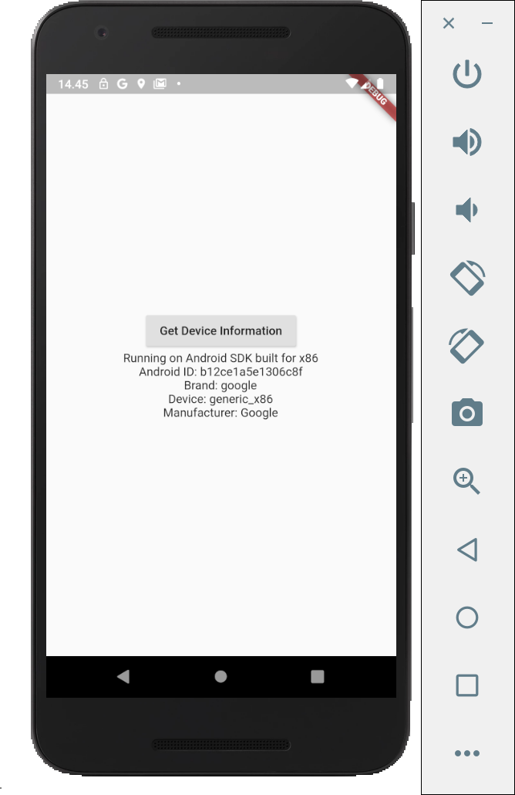

# case_system_info

A new Flutter application that uses packages and plugins to show Android system information. In order to do this, we have to use ```DeviceInfoPlugin```

## Get ```device_info``` dependencies

In pubspec.yaml, add:
```
device_info: ^0.4.0+2
```

And run ```flutter pub get```.

## Import packages

```
import 'package:device_info/device_info.dart';

```

## Extending MyApp as Stateful Widget

To update the state of our Texts later

```
void main() => runApp(MyApp());
```

## Declare Global String Variables

```
String model = '' ;
String androidID = '' ;
String brand = '' ;
String device = '' ;
String manufacturer = '' ;
```

## Class DemoPage

```class DemoPage extends State<MyApp> {

  ...

  @override
  Widget build(BuildContext context) {
    return  MaterialApp(
        title: 'Hello World App',
        home: new Scaffold(
          body: Center(
            child: Column(
              mainAxisAlignment: MainAxisAlignment.center,
              children: <Widget>[
                RaisedButton(
                  onPressed: () async {
                    await getDeviceInfo();
                  },
                  child: Text('Get Device Information'),
                ),
                Text(model),
                Text(androidID),
                Text(brand),
                Text(device),
                Text(manufacturer),
              ],
            ),
          )
        )
    );
  }
}
```

## ```getDeviceInfo()``` Method

```getDeviceInfo()``` calls DeviceInfoPlugin. Then we update our strings in ```setState()```.

```
getDeviceInfo() async {
    DeviceInfoPlugin deviceInfo = DeviceInfoPlugin();
    AndroidDeviceInfo androidInfo = await deviceInfo.androidInfo;

    setState(() {
      model = 'Running on ${androidInfo.model}';
      androidID = 'Android ID: ${androidInfo.androidId}';
      brand = 'Brand: ${androidInfo.brand}';
      device = 'Device: ${androidInfo.device}';
      manufacturer = 'Manufacturer: ${androidInfo.manufacturer}';
    });
  }
```

## Result

